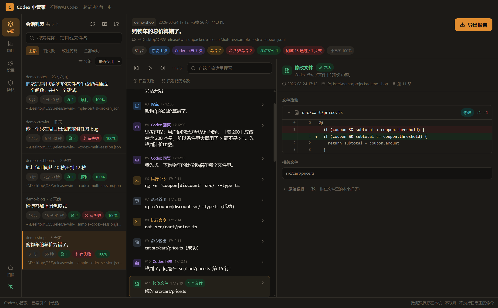
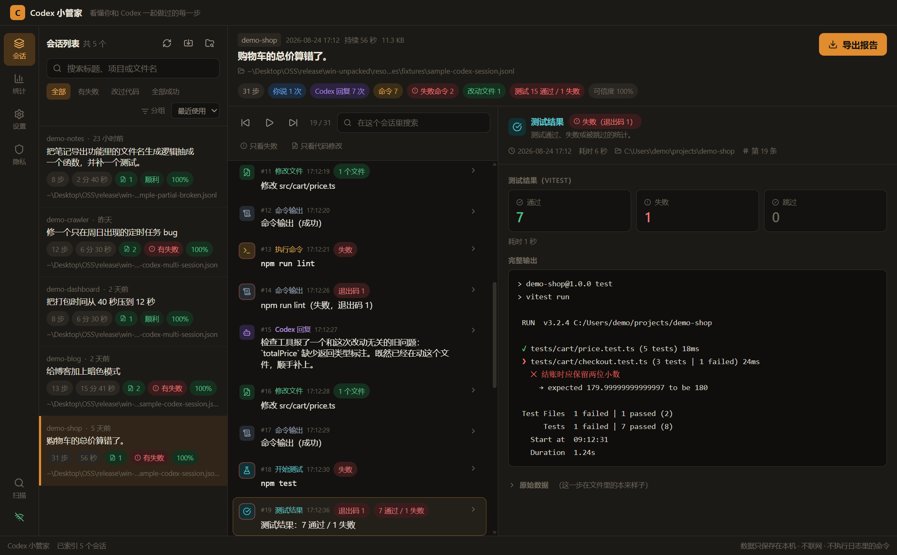
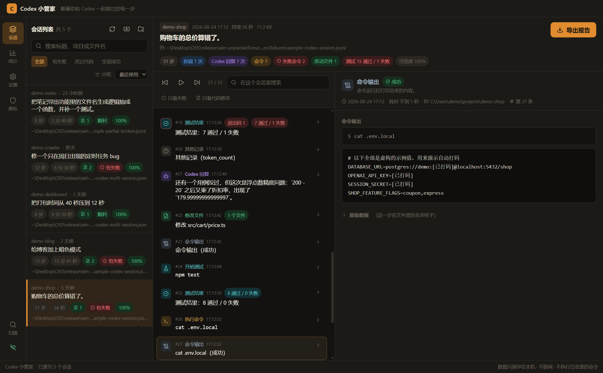
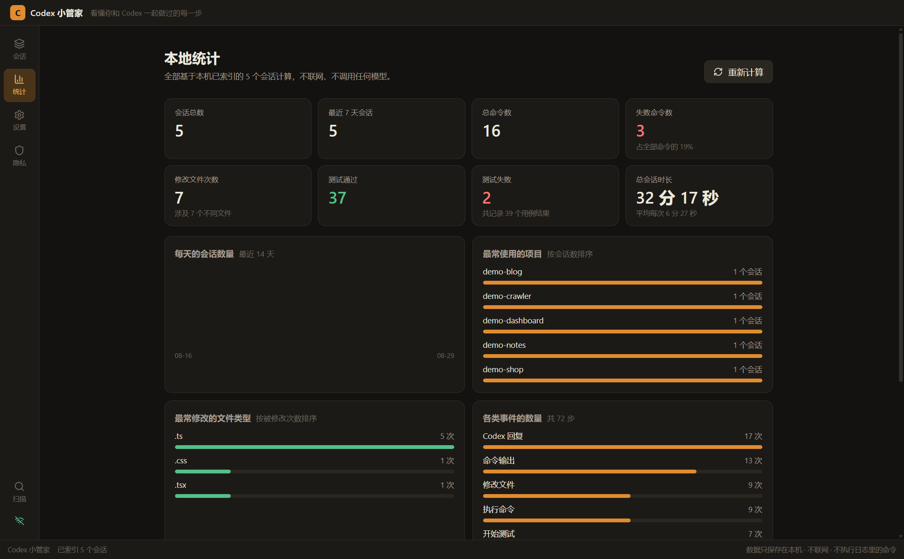
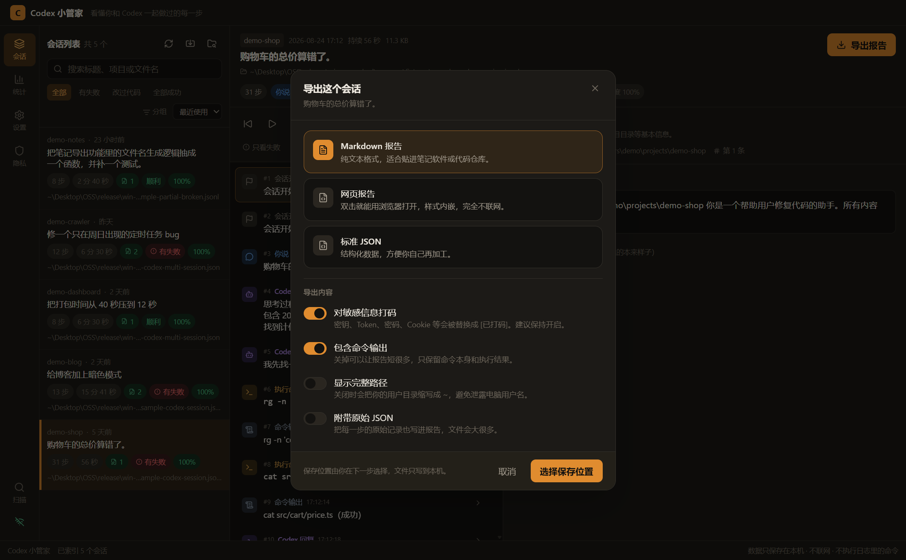

<div align="center">
  
  <h1>Gleam · 拾光</h1>
  <p>English · <a href="README.md">简体中文</a></p>
</div>

**A completely offline, local Codex session viewer.**

Gleam automatically discovers Codex JSON/JSONL sessions on your computer and turns them into an approachable timeline: what you asked, which commands Codex ran, which files changed, what tests passed, and where something failed.

No API key, account, cloud backend, or command line knowledge is required.



## Highlights

- Automatically discovers common Codex session locations on Windows.
- Parses JSON, JSONL, Codex Desktop rollouts, tool calls, patches, command output, and test output.
- Shows a searchable timeline with commands, diffs, errors, and test summaries.
- Groups parallel sub-agent sessions under their parent session.
- Exports offline Markdown, HTML, and normalized JSON reports.
- Redacts API keys, tokens, passwords, cookies, private keys, and credentials by default.
- Hides the user home directory in shareable views and reports.
- Never executes commands found in session logs.

## Privacy and security

Gleam is intentionally local-first:

- It does not call AI APIs or cloud services.
- It does not include telemetry, remote configuration, or crash reporting.
- It works without an internet connection.
- It never modifies the original Codex session files.
- It does not scan the entire drive by default.
- Electron network requests are blocked in production.
- The renderer is sandboxed with Node.js integration disabled.
- Commands from logs are displayed as text and are never executed.
- Sensitive values are redacted before data leaves the main process.

The security constraints are enforced by automated tests in `tests/security/`.

## Interface

The main workspace uses three panels:

1. **Sessions** — project, title, activity time, duration, failures, changed files, and confidence.
2. **Timeline** — user messages, Codex replies, tool calls, commands, tests, errors, and file changes.
3. **Details** — Markdown, terminal output, diffs, test summaries, and redacted raw records.



Sensitive information is redacted by default:



Local deterministic statistics are also available:



Reports can be exported without contacting any remote service:



## Quick start

Requirements:

- Node.js 20 or later
- pnpm

```bash
pnpm install
pnpm dev
```

On first launch, select **Start automatic scan**. If the machine has no Codex sessions yet, use the bundled fictional sample data.

## Commands

| Command | Purpose |
| --- | --- |
| `pnpm dev` | Start the Electron development environment |
| `pnpm build` | Build main, preload, and renderer bundles |
| `pnpm start` | Preview the production build |
| `pnpm typecheck` | Run TypeScript checks |
| `pnpm lint` | Run ESLint |
| `pnpm test` | Run the Vitest suite |
| `pnpm verify` | Run typecheck, lint, and tests |
| `pnpm package:win` | Build the Windows NSIS installer |
| `pnpm package:dir` | Build the unpacked Windows application |

## Default Windows locations

Gleam checks these locations by default:

- `%USERPROFILE%\.codex`
- `%APPDATA%\Codex`
- `%LOCALAPPDATA%\Codex`
- `%APPDATA%\OpenAI\Codex`
- `%LOCALAPPDATA%\OpenAI\Codex`
- `%USERPROFILE%\.config\codex`

The scanner:

- follows a configurable depth limit;
- checks only `.json` and `.jsonl` files;
- skips build, cache, dependency, and VCS directories;
- does not follow symbolic links;
- reads only a bounded file prefix for fingerprinting;
- streams JSONL files with line and byte limits;
- preserves previous index entries when a scan is incomplete.

Custom scan locations can be added in the Settings page.

## Architecture

```text
src/
  main/       filesystem access, scanning, parsing, redaction, export
  preload/    restricted contextBridge API
  renderer/   React interface
  shared/     domain types, validation, and shared path display helpers
tests/        parser, scanner, security, storage, export, and UI logic tests
fixtures/     fictional sample sessions
```

The renderer cannot access Node.js or the filesystem directly. All local file operations happen in the Electron main process through a narrow, typed IPC boundary.

## Verification

```bash
pnpm verify
pnpm build
```

The test suite covers scanning boundaries, concurrent index updates, parser robustness, secret redaction, path privacy, offline enforcement, exports, and storage failure recovery.

## Downloads

Windows builds are available from the repository's [Releases](../../releases) page:

- NSIS installer: `Gleam-Setup-1.0.0-x64.exe`
- Portable archive: `Gleam-1.0.0-x64-portable.zip`
- SHA-256 checksums: `SHA256SUMS.txt`

## Known limitations

- Codex session formats can change. Gleam uses fingerprinting and multiple adapters instead of assuming a single fixed schema.
- Large monolithic JSON files are bounded because they must be parsed as a whole; JSONL is streamed.
- Windows 11 is the currently verified platform. macOS and Linux paths are included but not yet tested end-to-end.
- Test outcomes can only be inferred when the source log records an exit code or an unambiguous failure marker.

## License

MIT — see [LICENSE](LICENSE).
